# Tiled Merkle trees: an illustrated walkthrough

This page builds a visual model of how an append-only Merkle tree moves from
memory into immutable tile files, and how proofs continue to work across both
places.

> [!IMPORTANT]
> **Every example on this page uses an imaginary tile width of 32 entries
> purely to keep the diagrams readable.**
>
> The merklecpp implementation remains fixed at `TILE_WIDTH = 256` and
> `TILE_HEIGHT = 8`. A width of 32 is not a configuration option, and this page
> does not propose changing the code, file format, defaults, or examples
> elsewhere. Unless a section explicitly says "illustrative", use 256.

## The scaled-down model

A production tile contains 256 entries and spans 8 binary tree levels because
`256 = 2^8`. This page scales that geometry down to 32 entries and 5 levels
because `32 = 2^5`.

| Property | This page only | Production merklecpp |
|---|---:|---:|
| Tile width | 32 entries | 256 entries |
| Tree levels spanned by one tile | 5 | 8 |
| Leaves covered by one full level-0 tile | 32 | 256 |
| Leaves covered by one level-1 entry | 32 | 256 |
| Leaves covered by one full level-1 tile | 1,024 | 65,536 |

The scaling changes only the numbers in the drawings. The rules are the same:

1. Only full tiles are written.
2. A level-0 tile contains leaf hashes.
3. A higher-level tile contains roots of complete tiles from the level below.
4. The incomplete right-hand frontier remains in memory.
5. Published tiles are immutable.
6. Proofs can resolve subtree roots from memory, tiles, or both.

### Notation

- `h7` is the hash of leaf 7.
- `R[a, b)` is the Merkle root of the half-open leaf range `[a, b)`.
- `tile/L/NNN` is tile index `NNN` at tile level `L`.
- "Resident" means the in-memory tree can still expand that range to answer
  proof requests.
- "Compacted" means the in-memory tree retains enough summary hashes to keep
  its root correct, but no longer retains all detail below that range.

### Colors used below

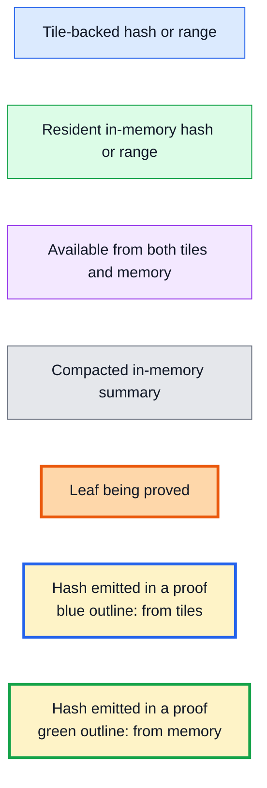

## What `flush()` and `compact()` each do

Appending, flushing, and compacting are separate operations:

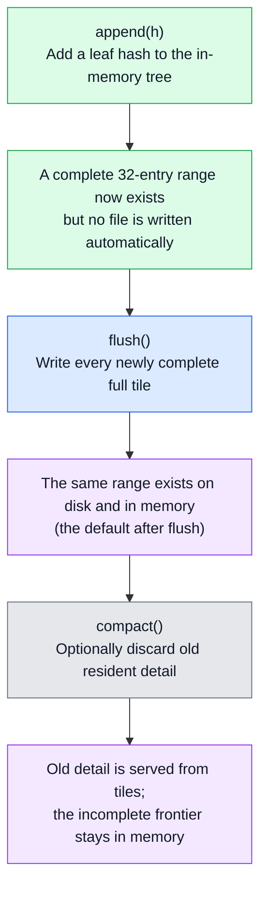

`flush()` does not compact by default. Setting `compact_on_flush = true` makes
the final two steps happen in one call, but the durability rule is unchanged:
compaction happens only after all required tile writes succeed.

If a tile write fails, `immutable_size()` may advance past `flushed_size()`
because a published tile cannot be rolled back. Keep the same tree contents and
retry the flush. See
[Flushing and compaction](tiles-guide.md#flushing-and-compaction) for the full
interrupted-write contract.

## What is inside a tile file?

In the illustrative model, `tile/0/000` is the concatenation of 32 leaf hashes:

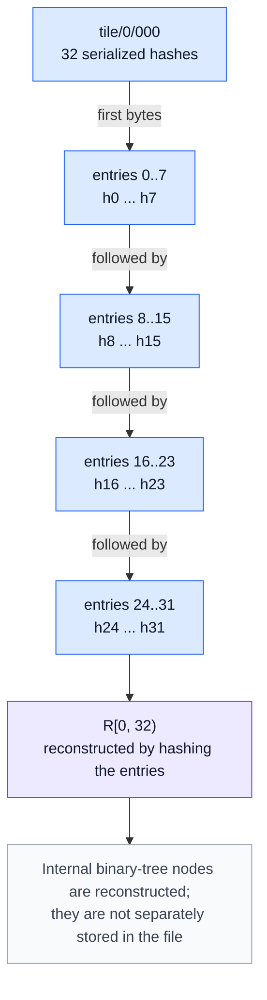

At level 1, each entry is already the root of 32 leaves:

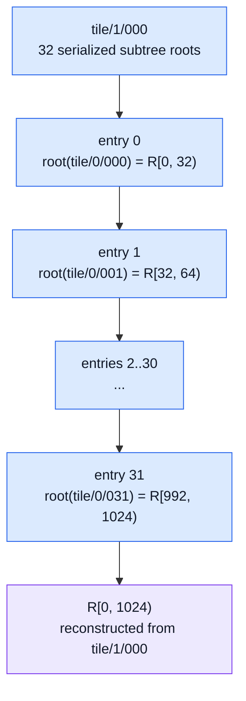

The production version of the second diagram needs 256 level-0 tile roots, so
its first full level-1 tile appears at 65,536 leaves rather than 1,024.

## On-disk file layout

After an illustrative 1,030-leaf tree is flushed, the full-tile boundary is
1,024:

```text
prefix/
  tile/
    0/
      000        # h0       ... h31
      001        # h32      ... h63
      ...
      031        # h992     ... h1023
    1/
      000        # R[0,32), R[32,64), ... R[992,1024)
```

Leaves `[1024, 1030)` do not appear in a tile file because they do not complete
another 32-entry tile. They remain in memory.

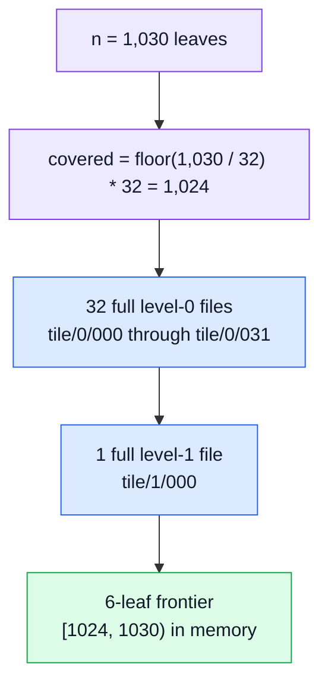

The optional `tile/entries/` bundles are omitted here. They store raw
application entries, not Merkle tree nodes, and do not change proof generation.

## Tree growth, one snapshot at a time

The next snapshots assume `retention_margin = 0`. Where compaction is shown,
merklecpp still retains the final tiled leaf as a boundary leaf. This is why
the "both" range below is one leaf wide.

### Snapshot A: 20 leaves

No full 32-entry tile exists:

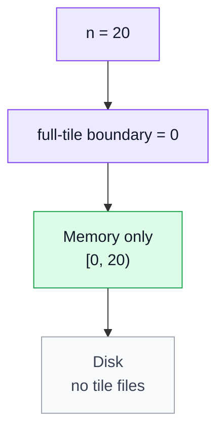

Calling `flush()` at this point writes nothing. Every root and proof is served
from the in-memory tree.

### Snapshot B: 40 leaves, before the first flush

The first 32 leaves form a complete tile, but tile creation is explicit:

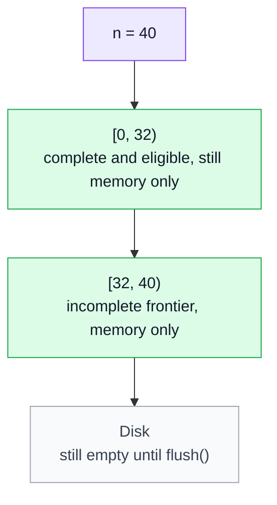

### Snapshot B: 40 leaves, after `flush()`

The default `flush()` writes the full prefix but does not remove it from
memory:

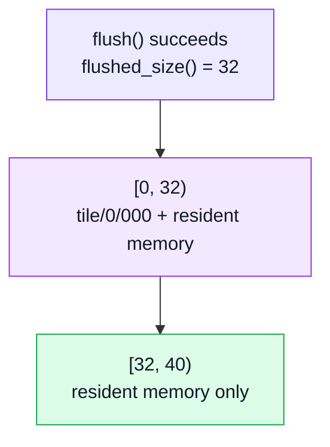

At this point a proof may be answered entirely from memory even though a tile
copy exists.

### Snapshot B: 40 leaves, after compaction

With zero retention, compaction drops old leaf detail while preserving leaf 31
as the rollback boundary:

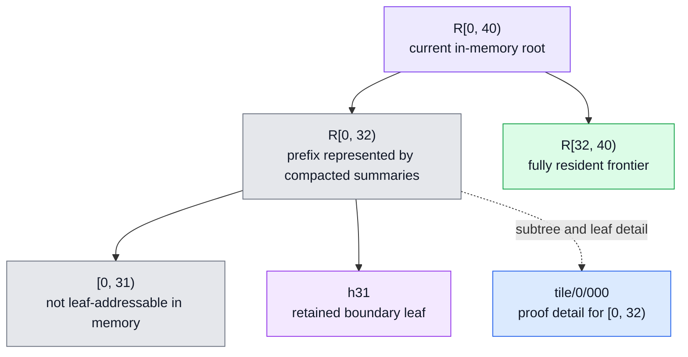

There are now three logical ownership ranges:

| Leaf range | Proof detail available from |
|---|---|
| `[0, 31)` | tiles only |
| `[31, 32)` | tiles and memory |
| `[32, 40)` | memory only |

The compacted in-memory summaries still contribute to `root()`. "Tiles only"
means that a request for a leaf or complete subtree in that range must use the
tile source; it does not mean the in-memory root forgot the prefix hash.

### Snapshot C: grow from 40 to 72 leaves

Assume the tree was flushed and compacted at size 40, then 32 more leaves were
appended.

Before the second flush:

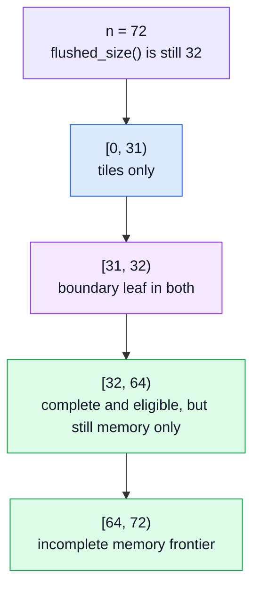

After the second flush and compaction:

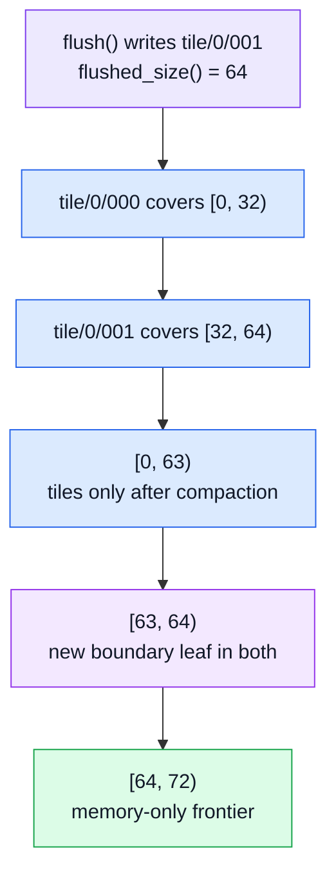

### Snapshot D: 1,030 leaves

This is the first snapshot with a full illustrative level-1 tile:

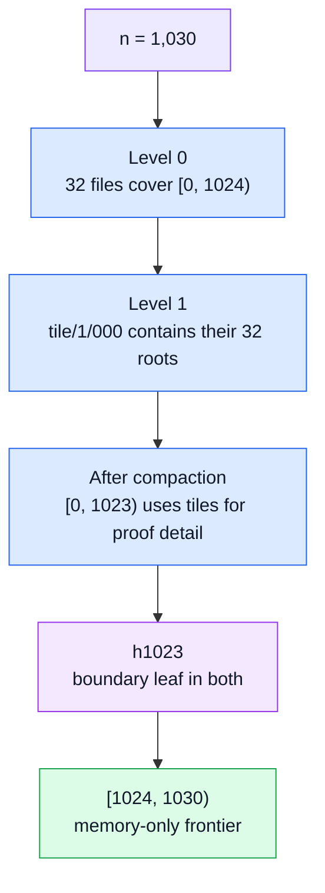

### Snapshot summary

This table assumes each snapshot has just completed a successful flush and
compaction with zero retention:

| Tree size | `flushed_size()` | Files written | Tiles only | Tiles + memory | Memory only |
|---:|---:|---|---|---|---|
| 20 | 0 | none | none | none | `[0, 20)` |
| 40 | 32 | `tile/0/000` | `[0, 31)` | `[31, 32)` | `[32, 40)` |
| 72 | 64 | `tile/0/000..001` | `[0, 63)` | `[63, 64)` | `[64, 72)` |
| 1,030 | 1,024 | 32 level-0 tiles + `tile/1/000` | `[0, 1023)` | `[1023, 1024)` | `[1024, 1030)` |

Again, multiply the tile geometry back to 256 for production. In particular,
the production level-1 example starts at 65,536 leaves, not 1,024.

## How a proof finds a subtree root

`TiledTree` gives `ProofEngine` a combined source. It tries the resident tree
first because that avoids I/O, then falls back to tiles:

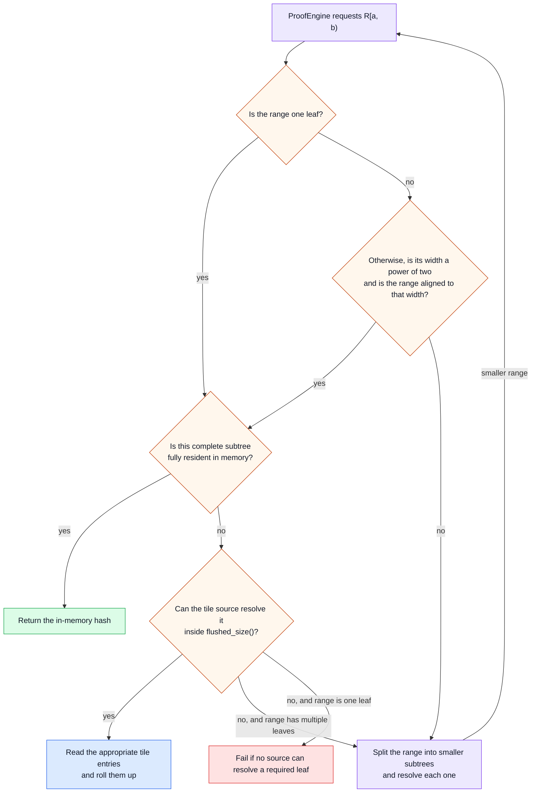

For example, after compacting the 40-leaf tree:

- `R[0, 32)` is not fully resident, so memory declines it and tiles return it.
- `R[32, 36)` is resident, so memory returns it without touching disk.
- `R[24, 40)` crosses the boundary and is not one complete aligned subtree.
  The proof engine splits it into resolvable pieces.

## Inclusion proof 1: entirely from one tile

Consider a proof against tree size 32 after `tile/0/000` has been written and
the old leaves have been compacted. This may be the current size or a historical
prefix of a larger tree. We want to prove leaf 5.

Every required hash is reconstructed from `tile/0/000`:

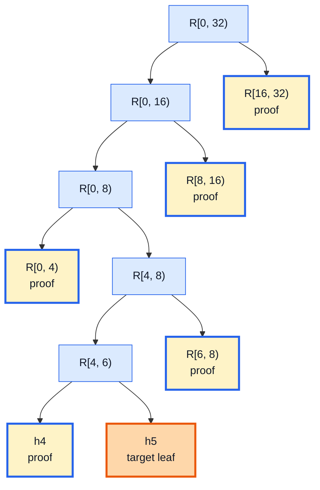

The proof payload is ordered from the leaf toward the root:

| Order | Proof hash | Position relative to the running hash | Source |
|---:|---|---|---|
| 1 | `h4` | left | `tile/0/000` |
| 2 | `R[6, 8)` | right | `tile/0/000` |
| 3 | `R[0, 4)` | left | `tile/0/000` |
| 4 | `R[8, 16)` | right | `tile/0/000` |
| 5 | `R[16, 32)` | right | `tile/0/000` |

The internal roots in this table are computed on demand from the tile's leaf
hashes. They are not additional files.

Verification starts with `h5`, combines the five proof hashes in order, and
arrives at `R[0, 32)`.

## Inclusion proof 2: tiles and memory together

Return to the compacted 40-leaf tree and prove leaf 36 against the current root
`R[0, 40)`.

The target and its nearby siblings are in the resident frontier. The old
32-leaf prefix is supplied as one tile-backed subtree root:

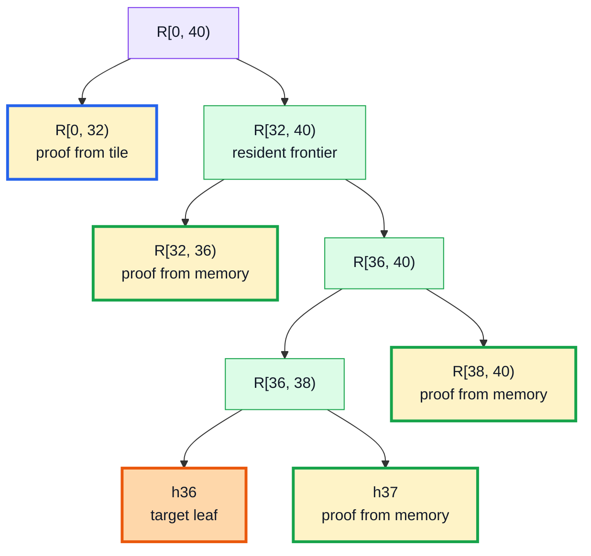

The mixed proof payload is:

| Order | Proof hash | Position | Source |
|---:|---|---|---|
| 1 | `h37` | right | memory |
| 2 | `R[38, 40)` | right | memory |
| 3 | `R[32, 36)` | left | memory |
| 4 | `R[0, 32)` | left | `tile/0/000` |

The caller sees one ordinary `merkle::Path`. Source selection is internal; the
proof format does not mark some hashes as "tile" and others as "memory".

Proving an old leaf in the current tree is mixed in the opposite direction.
For example, a proof for leaf 5 at size 40 gets its target and lower siblings
from `tile/0/000`, then gets the final sibling `R[32, 40)` from memory.

## Consistency proofs: the idea

An inclusion proof answers:

> Is this leaf part of this tree root?

A consistency proof answers:

> Can the tree with `m` leaves be extended, without changing its first `m`
> leaves, to produce the tree with `n` leaves?

The verifier already knows:

- `m` and the old root `R[0, m)`;
- `n` and the new root `R[0, n)`.

The proof supplies enough complete subtree roots to reconstruct both roots
through a shared history.

The producer recursively follows the part of the new tree that contains the
old boundary and emits the sibling subtree at each split:

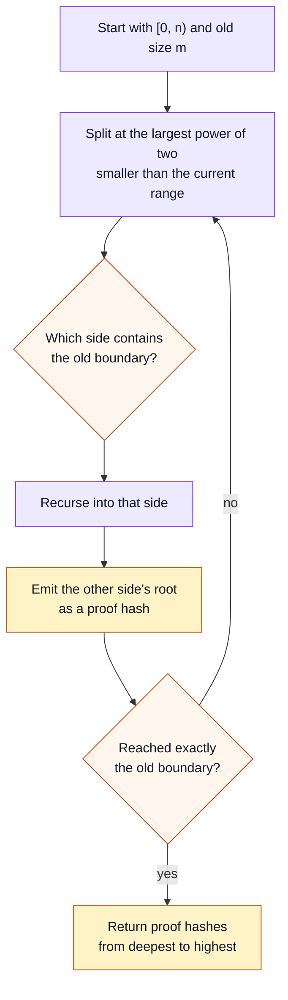

Each emitted range is resolved through the same memory-first, tile-second
source used by inclusion proofs.

## Consistency proof 1: a perfect old tree

First prove that the 32-leaf tree is a prefix of the 40-leaf tree:

```cpp
auto proof = log.consistency_proof(32, 40);
```

Because 32 is a power of two, the old root is already one complete left
subtree. The proof needs only the new right-hand range:

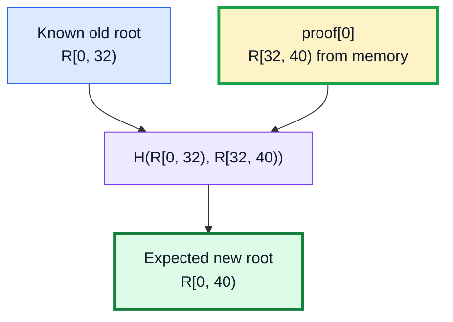

The old root may have been calculated from `tile/0/000`; the extension is
resident in memory. Verification combines the known old root with the single
proof hash and compares the result with the known new root.

## Consistency proof 2: a non-perfect old tree

Now prove that the 20-leaf tree is a prefix of the 40-leaf tree:

```cpp
auto proof = log.consistency_proof(20, 40);
```

Size 20 is not a power of two, so the old root does not line up with a single
node in the 40-leaf tree. The proof decomposes the relevant ranges:

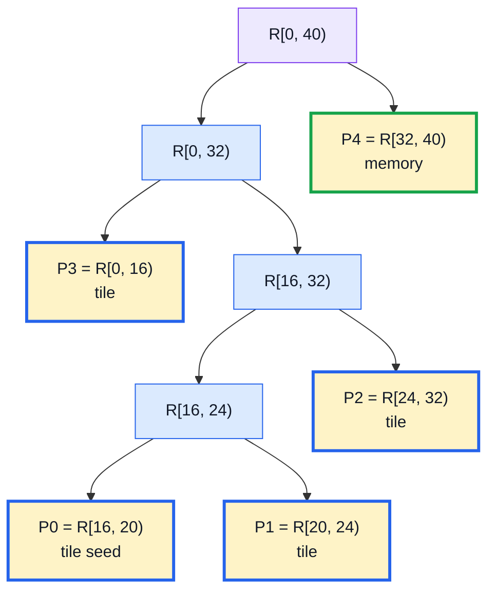

The proof vector contains hashes only; the range labels are shown here to make
the algorithm visible. Given `m = 20` and `n = 40`, the verifier derives where
each hash belongs.

| Order | Illustrative range | Source | Why it is needed |
|---:|---|---|---|
| `P0` | `R[16, 20)` | tile | Seed shared by old and new reconstructions |
| `P1` | `R[20, 24)` | tile | Extend only the new reconstruction |
| `P2` | `R[24, 32)` | tile | Extend only the new reconstruction |
| `P3` | `R[0, 16)` | tile | Complete both the old and new left sides |
| `P4` | `R[32, 40)` | memory | Extend the new reconstruction to size 40 |

Verification evolves two accumulators:

The verifier uses the bit structure of `m` and `n` to decide which accumulator
each proof hash updates. Intuitively, `P0` seeds a subtree shared by both
histories and `P3` completes that shared old-tree boundary. `P1`, `P2`, and
`P4` cover leaves at or beyond the old size, so they extend only the new
accumulator.

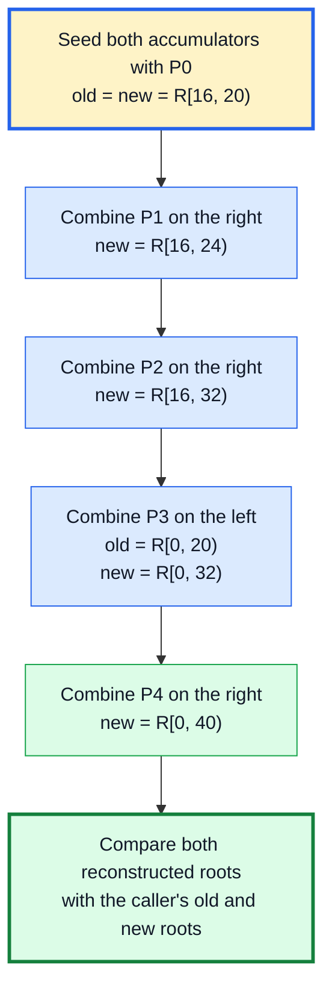

This example is mixed in a useful way:

- The old 20-leaf state can be reconstructed from the first tile even though
  the live in-memory tree has compacted those leaves.
- The newly appended range `[32, 40)` comes from memory.
- The proof is still an ordinary vector of hashes, independent of where each
  hash was found.

## The complete mental model

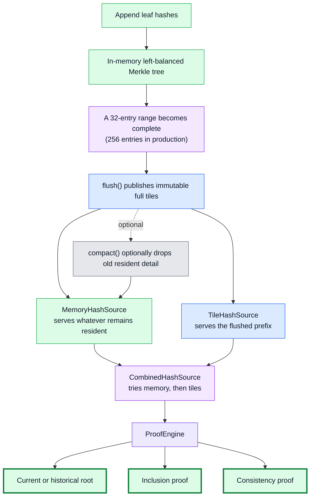

The important boundary is always the last successfully flushed full tile:

- Below it, immutable tiles can preserve proof detail after compaction.
- Above it, the incomplete frontier must remain resident in memory.
- A proof may resolve several component subtrees from either side of the
  boundary, but the caller receives one normal proof.
- None of these rules depends on the illustrative width of 32. Production uses
  the same model with 256-entry tiles.
